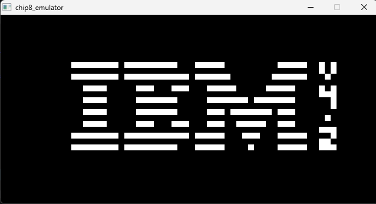
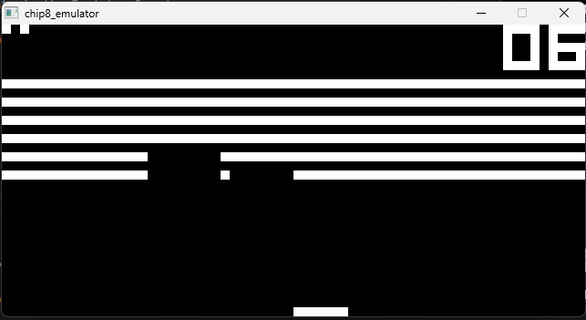

<h1 align="center">CHIP8 Emulator</h1>
<p align="center">This is a chip_8 emulator made in C and Raylib</p>


## Demo
 



## Run with
```cmd
gcc *.c -o main.exe -lraylib -lopengl32 -lgdi32 -lwinmm
```

## Built With
- c
- raylib

## Credits
- Used Timendus's [test suite]((https://github.com/Timendus/chip8-test-suite)) for testing all the opcode
- Used [david winter](https://github.com/kripod/chip8-roms)'s space_invaders and breakout for testing as well
- Used [universfield](https://pixabay.com/users/universfield-28281460/)'s sound beep sound effect

## References
- https://craigthomas.ca/tag/chip8.html
- https://github.com/kripod/chip8-roms
- https://austinmorlan.com/posts/chip8_emulator/
- https://github.com/Timendus/chip8-test-suite
- https://www.cs.columbia.edu/~sedwards/classes/2016/4840-spring/designs/Chip8.pdf
- https://faizilham.com/revisiting-chip8
- https://pixabay.com/sound-effects/film-special-effects-notification-beep-229154/